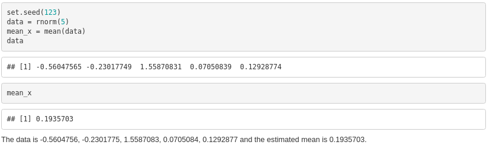

# Objectives
```{r, load_refs, echo=FALSE, cache=FALSE, message=F, warning=F}
library(RefManageR)
library(xaringanExtra)
library(icon)
library(magrittr)
BibOptions(check.entries = FALSE, 
           bib.style = "authoryear", 
           cite.style = 'authoryear', 
           style = "markdown",
           hyperlink = FALSE, 
           dashed = FALSE)
myBib <- ReadBib("assets/example.bib", check = FALSE)
```


- Understand challenges in scientific reporting

- Understand benefits of using the RStudio ecosystem and Rmarkdown for scientific reporting

- Technologies needed to install and master when producing scientific reports with the R ecosystem 

- Integration of the various elements that are essential for production

- Be aware of advanced integration options and the use of various tools that support productivity in scientific reporting

- Please note that this workshop is evaluated in the framework of a pedagogical training organised by the Pôle de Soutien à l'Enseignement et à l'Apprentissage - UNIGE

---
# Tools


- [`r icon::fontawesome("r-project") %>% icon_style(fill="#165CAA")` ](https://www.r-project.org/)
```{r, eval = F}
# install.packages("package_name")
library(plotly)
library(knitr)
```
- [`RStudio`](https://www.rstudio.com/)

.pull-right[]
- Wooclap  
    - [https://www.wooclap.com/INTROSTATWSRMD](https://www.wooclap.com/INTROSTATWSRMD)


- Zoom 
    - [https://unige.zoom.us/j/95232514091](https://unige.zoom.us/j/95232514091)
    - Meeting ID: 952 3251 4091


---
# Scientific reporting


###  What is scientific reporting and its challenges?
**Scientific**
<blockquote>
conducted in the manner of science or according to results of investigation by science : practicing or using thorough or systematic methods 
.right[-- <cite>Merriam-Webster</cite>]
</blockquote>

**Report**
<blockquote>
give a spoken or written account of something that one has observed, heard, done, or investigated.
.right[-- <cite>Merriam-Webster</cite>]
</blockquote>


---
class: inverse, center, middle

# What is scientific reporting and what are elements we may want to include in a scientific report?


---
# Rmarkdown 


`Rmarkdown` (or R Markdown) is a syntax for creating documents using literate programming. This technique allows the combination of document narrative and code computation to dynamically generate documents in different formats. This allows the creation of scientific reports that combine textual elements written by the authors with computed elements, such as visual representations or the results of a statistical analysis or data modelling. 

.center[]


---
# Rmarkdown
### Technologies


<blockquote>
In a nutshell, R Markdown stands on the shoulders of knitr and Pandoc. The former executes the computer code embedded in Markdown, and converts R Markdown to Markdown. The latter renders Markdown to the output format you want (such as PDF, HTML, Word, and so on).
.right[-- <cite>R Markdown: The Definitive Guide</cite>]
</blockquote>


.center[]

---

# Opening a New `RMarkdown` document in `Rstudio`

<!-- .center[] -->

.center[]


---
# The YAML

The `YAML` header declare various elements of the aesthetics and compilation options of your document.

- Title, author, date, ouput format (LATEX for PDF), theme, css, etc

```{r, eval =F}
---
title: Scientific Reporting
author: Lionel Voirol
date: "4/25/2021"
output:
  html_document:
    css: "my_style.css"
    toc: true
    theme: united
bibliography: biblio.bib

---
```

---
# Title

```{r, eval =F}
---
title: Scientific Reporting #<<
author: Lionel Voirol
date: "4/25/2021"
output:
  html_document:
    css: "my_style.css"
    toc: true
    theme: united
bibliography: biblio.bib

---
```

---
# Author

```{r, eval =F}
---
title: Scientific Reporting 
author: Lionel Voirol#<<
date: "4/25/2021"
output:
  html_document:
    css: "my_style.css"
    toc: true
    theme: united
bibliography: biblio.bib

---
```


---

# Date

```{r, eval =F}
---
title: Scientific Reporting 
author: Lionel Voirol
date: "`r format(Sys.time(), '%d %B, %Y')`" #<<
output:
  html_document:
    css: "my_style.css"
    toc: true
    theme: united
bibliography: biblio.bib

---
```
---

# Output

```{r, eval =F}
---
title: Scientific Reporting 
author: Lionel Voirol
date: "`r format(Sys.time(), '%d %B, %Y')`" 
output:#<<
  pdf_document:#<<
    toc: true#<<
bibliography: biblio.bib

---
```

Since compiling a `.Rmd` document in `.pdf` requires $\LaTeX$, we will moslty consider compilation in `.html` for the presentation. 
---


# Structure

```{r, eval =F}
# Header 1
## Header 2
### Header 3
```


# Header 1
## Header 2
### Header 3

---
# Table of content

Table fo content (`toc`) can be included with the `YAML` option `toc: true`.

```{r, eval =FALSE}
---
title: "demo"
author: "Lionel Voirol"
date: "4/25/2021"
output:
  html_document:
    toc: true
    theme: united
---
```

.center[]


---
# Graphs

---
# Images


---
# Gif 

```{r, eval=F}
 
```

<!-- <center> -->

 
<!-- </center> -->

---
# GIF with `iframe` tag

```{r, eval =F}
<iframe src="https://giphy.com/embed/l46CsCs3cOTdErUuk" width="480" height="263" frameBorder="0" class="giphy-embed" allowFullScreen></iframe><p><a href="https://giphy.com/gifs/election2016-hillary-clinton-i-believe-in-science-l46CsCs3cOTdErUuk">via GIPHY</a></p>
```

<center>

<iframe src="https://giphy.com/embed/l46CsCs3cOTdErUuk" width="480" height="263" frameBorder="0" class="giphy-embed" allowFullScreen></iframe><p><a href="https://giphy.com/gifs/election2016-hillary-clinton-i-believe-in-science-l46CsCs3cOTdErUuk">via GIPHY</a></p>
</center>


---
# Youtube with `iframe` tag
### Musical break with Koffi Olomidé interpreted by Youssoupha

```{r, eval =F}
<iframe width="560" height="315" src="https://www.youtube.com/embed/RALtocwIcWI?start=391" title="YouTube video player" frameborder="0" allow="accelerometer; autoplay; clipboard-write; encrypted-media; gyroscope; picture-in-picture" allowfullscreen></iframe>
```


<center>
<iframe width="760" height="415" src="https://www.youtube.com/embed/RALtocwIcWI?start=391" title="YouTube video player" frameborder="0" allow="accelerometer; autoplay; clipboard-write; encrypted-media; gyroscope; picture-in-picture" allowfullscreen></iframe>
</center>
---

# Pop-up menu and color box

```{r, eval =F}
<button data-toggle="collapse" data-target="#demo">
More info
</button>
<div id="demo" class="collapse">
<p>Some additional info… :)</p>
</div>
```


.center[]


```{r, eval =F}
<div class="alert alert-success">
<p><strong>Some important Info:</strong> something</p>
```


.center[]

---

# Themes

You can specify themes with the `YAML` option `theme`. `Rmarkdown` provide built-in themes but many themes are accessible by using external packages available on `CRAN` or on  GitHub.

```{r, eval =F}
---
title: Scientific Reporting
author: Lionel Voirol
date: "`r format(Sys.time(), '%d %B, %Y')`"
output:
  html_document:
    css: "my_style.css"
    toc: true
    theme: united #<<
bibliography: biblio.bib

---
```

---
# Themes

Find a non exhaustive gallery of available themes [here](https://www.datadreaming.org/post/r-markdown-theme-gallery/).


.pull-left[
.center[]
]


.pull-right[
.center[]
]


---
# `R` code (chunks and inline) 


```{r, eval = F}
set.seed(123)
data = rnorm(5)
mean_x = mean(data)
data
mean_x

```


```{r, eval = F}
The data is `r data` and the estimated mean is `r mean_x`.  #<<
```


.center[]


---

# `knitr` options

You can specify chunk option in the ````{r}` header of a `R` chunk of code.


---

# Emojis
```{r,eval =F}
`r emo::ji('alien')` `r emo::ji('sunglasses')` `r emo::ji('fire')`
```

&nbsp; 

&nbsp; 
<center>
`r emo::ji('alien')` `r emo::ji('sunglasses')` `r emo::ji('fire')`
</center>
---
class: inverse, center, middle

# Your turn!

&nbsp; 

.center[Try to compile a `.Rmd` document with a title, author, date, compiled `R` code, and a statistical graph (e.g. boxplot) of your choice. Show it to the audience if interested]

.center[Also, try to reproduce this equation in your document: 

$$s^{2}=\frac{\sum_{i=1}^{n}\left(x_{i}-\bar{X}\right)^{2}}{n-1}$$]

Hint: use $\LaTeX$ commands `^`,`_`, `\sum{}`,  `\frac{}{}` and `\bar{}`

What does this statistic represents?
---
# Bibliography

- Save a file in the same directory of your `.Rmd` file with extension `.bib`.
- Reference this file in the `YAML`.
For example considering the file `bilbio.bib` 

```{r, eval =F}
---
title: Scientific Reporting
author: Lionel Voirol
date: "`r format(Sys.time(), '%d %B, %Y')`"
output:
  html_document:
    css: "my_style.css"
    toc: true
    theme: united 
bibliography: biblio.bib #<<
---
```

  
---
# Bibliography

### Copying `.bib` references from Google Scholar

.center[]


---


---
# $\LaTeX$ support

### Centered Equation

```{r, eval =F}
$$Y_{i}=\beta_{0}+\beta_{1} X_{i 1}+\beta_{2} X_{i 2}+\ldots+\beta_{p} X_{i p}+\epsilon_{i}$$
```


$$Y_{i}=\beta_{0}+\beta_{1} X_{i 1}+\beta_{2} X_{i 2}+\ldots+\beta_{p} X_{i p}+\epsilon_{i}$$

    
    
### Inline equation

```{r, eval =F}
Hence, we consider the vector $\boldsymbol{\theta} \in \boldsymbol{\Theta}$
```

Hence, we consider the vector $\boldsymbol{\theta} \in \boldsymbol{\Theta}$


---
# HTML widgets

### plotly example

.scroll-box-20[
```{r, eval=F, echo=T, message=F, warning=F}
rm(list=ls())
library(plotly)
library(reshape2)
# example from https://stackoverflow.com/questions/38331198/add-regression-plane-to-3d-scatter-plot-in-plotly
#load data
my_df <- iris
petal_lm <- lm(Petal.Length ~ 0 + Sepal.Length + Sepal.Width,data = my_df)
# Graph Resolution (more important for more complex shapes)
graph_reso <- 0.05
#Setup Axis
axis_x <- seq(min(my_df$Sepal.Length), max(my_df$Sepal.Length), by = graph_reso)
axis_y <- seq(min(my_df$Sepal.Width), max(my_df$Sepal.Width), by = graph_reso)
#Sample points
petal_lm_surface <- expand.grid(Sepal.Length = axis_x,Sepal.Width = axis_y,KEEP.OUT.ATTRS = F)
petal_lm_surface$Petal.Length <- predict.lm(petal_lm, newdata = petal_lm_surface)
petal_lm_surface <- acast(petal_lm_surface, Sepal.Width ~ Sepal.Length, value.var = "Petal.Length") #y ~ x
#define color
mycol = RColorBrewer::brewer.pal(n = 3, name = "Dark2")
hcolors=c(mycol)[my_df$Species]
iris_plot <- plot_ly(my_df, 
                     x = ~Sepal.Length, 
                     y = ~Sepal.Width, 
                     z = ~Petal.Length,
                     text = ~Species, # EDIT: ~ added
                     type = "scatter3d", 
                     mode = "markers",
                     marker = list(color = hcolors))
iris_plot <- add_trace(p = iris_plot,
                       z = petal_lm_surface,
                       x = axis_x,
                       y = axis_y,
                       type = "surface")
iris_plot
```
]


---
# HTML widgets

```{r, eval=F, echo=F, message=F, warning=F}
rm(list=ls())
library(plotly)
library(reshape2)
# example from https://stackoverflow.com/questions/38331198/add-regression-plane-to-3d-scatter-plot-in-plotly
#load data
my_df <- iris
petal_lm <- lm(Petal.Length ~ 0 + Sepal.Length + Sepal.Width,data = my_df)
# Graph Resolution (more important for more complex shapes)
graph_reso <- 0.05
#Setup Axis
axis_x <- seq(min(my_df$Sepal.Length), max(my_df$Sepal.Length), by = graph_reso)
axis_y <- seq(min(my_df$Sepal.Width), max(my_df$Sepal.Width), by = graph_reso)
#Sample points
petal_lm_surface <- expand.grid(Sepal.Length = axis_x,Sepal.Width = axis_y,KEEP.OUT.ATTRS = F)
petal_lm_surface$Petal.Length <- predict.lm(petal_lm, newdata = petal_lm_surface)
petal_lm_surface <- acast(petal_lm_surface, Sepal.Width ~ Sepal.Length, value.var = "Petal.Length") #y ~ x
#define color
mycol = RColorBrewer::brewer.pal(n = 3, name = "Dark2")
hcolors=c(mycol)[my_df$Species]
iris_plot <- plot_ly(my_df, 
                     x = ~Sepal.Length, 
                     y = ~Sepal.Width, 
                     z = ~Petal.Length,
                     text = ~Species, # EDIT: ~ added
                     type = "scatter3d", 
                     mode = "markers",
                     marker = list(color = hcolors))
iris_plot <- add_trace(p = iris_plot,
                       z = petal_lm_surface,
                       x = axis_x,
                       y = axis_y,
                       type = "surface")
iris_plot
```


---
class: sydney-blue, center, middle
background-size: 260px
background-position: 5% 95%

# Thanks! Any questions?

.pull-down[

<a href="mailto:garth.tarr@sydney.edu.au">
.white[`r icon::fontawesome("paper-plane")` Lionel.Voirol@unige.ch]
</a>

<a href="http://github.com/garthtarr">
.white[`r icon::fontawesome("github")` @lionelvoirol]
</a>

<br><br><br>

]

