# Objectives
```{r, eval =T,echo=FALSE, cache=FALSE, message=F, warning=F}
library(RefManageR)
BibOptions(check.entries = FALSE, 
           bib.style = "authoryear", 
           cite.style = 'authoryear', 
           style = "markdown",
           hyperlink = FALSE, 
           dashed = FALSE)
myBib <- ReadBib("assets/example.bib", check = FALSE)
```

```{r, load_refs, echo=FALSE, cache=FALSE, message=F, warning=F}
library(xaringanExtra)
library(icon)
library(magrittr)
```


- Understand challenges in scientific reporting

- Understand benefits of using the `RStudio` ecosystem and `RMarkdown` for scientific reporting

- Understand which technologies interoperate when compiling a `.Rmd` file

- Acquire the ability to produce a simple scientific report using `RMarkdown` whcih contains essential elements (a structure, $\LaTeX$ equations, code, graphs, references) 

- Be aware of the use of `Git` and `GitHub` for collaborative writing/programming and Mathpix to easily copy Math equation.

- Be aware of advanced integration and customization options


.content-box-blue[Note that this workshop is evaluated in the framework of a pedagogical training organised by the Pôle de Soutien à l'Enseignement et à l'Apprentissage - UNIGE
]

---
# Tools


- [`r icon::fontawesome("r-project") %>% icon_style(fill="#165CAA")` ](https://www.r-project.org/)

- [`RStudio`](https://www.rstudio.com/)

.pull-right[]
- Wooclap  
    - [https://www.wooclap.com/INTROSTATWSRMD](https://www.wooclap.com/INTROSTATWSRMD)


- Zoom 
    - [https://unige.zoom.us/j/95232514091](https://unige.zoom.us/j/95232514091)
    - Meeting ID: 952 3251 4091
    
- [`RMarkdown` playground web app](https://dal-unige.shinyapps.io/rmd_app/)

---
# Program

- Introduction
- Opening and compiling a `RMarkdown (.Rmd)` document from `RStudio` and the `YAML`
- Your turn ! (individual exercise)  😱
- Essentials elements for scientific reporting
- Interactive elements
- Your turn ! (group exercise) 😱
- Tools for Scientific reporting
- Templates and advanced customization options
- Q&A


---
# Scientific reporting


###  What is scientific reporting and its challenges? 
**Scientific**
<blockquote>

conducted in the manner of science or according to results of investigation by science : practicing or using thorough or systematic methods 
.right[-- <cite>Merriam-Webster</cite>]
</blockquote>

&nbsp;

**Report**
<blockquote>
give a spoken or written account of something that one has observed, heard, done, or investigated.
.right[-- <cite>Merriam-Webster</cite>]
</blockquote>


---
class: inverse, center, middle

# What elements might one wish to include in a scientific report?


---
class: inverse, center, middle

# What are the challenges in scientific writing that you can think of?

---
# Rmarkdown 


`Rmarkdown` (or R Markdown) is a syntax for creating documents using literate programming. This technique allows the combination of document narrative and code computation to dynamically generate documents in different formats. This allows the creation of scientific reports that combine textual elements written by the authors with computed elements, such as visual representations or the results of a statistical analysis or data modelling. 

.center[]


---
# Rmarkdown
### Technologies


<blockquote>
In a nutshell, R Markdown stands on the shoulders of knitr and Pandoc. The former executes the computer code embedded in Markdown, and converts R Markdown to Markdown. The latter renders Markdown to the output format you want (such as PDF, HTML, Word, and so on).
.right[-- <cite>R Markdown: The Definitive Guide</cite>]
</blockquote>


.center[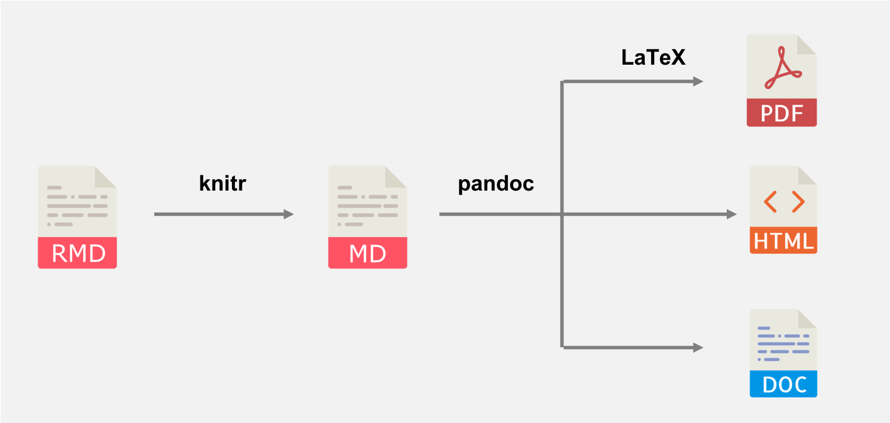]

---

class: inverse, center, middle

# Essentials


---
# Opening a new `RMarkdown` document in `Rstudio`

<!-- .center[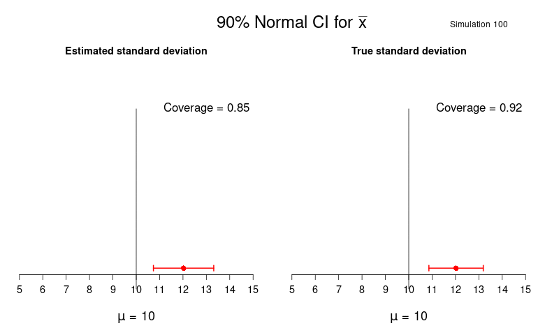] -->

.center[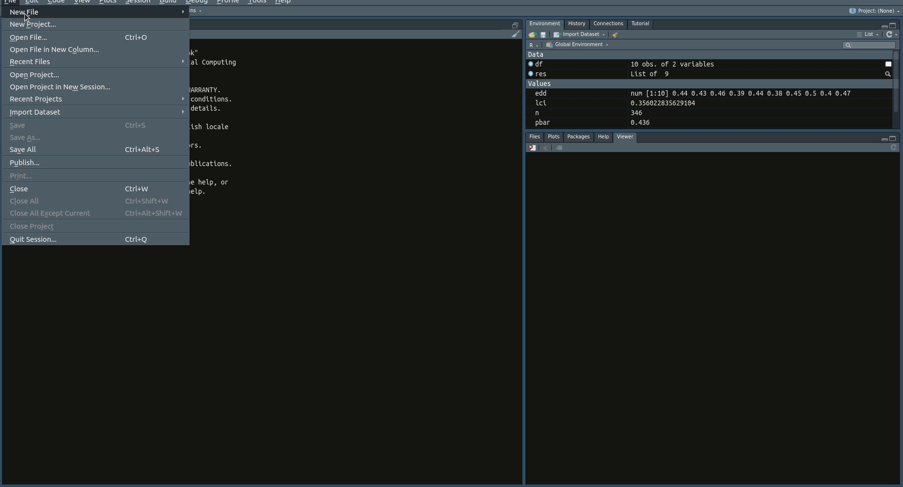]


---
# The `YAML` header

The `YAML` header declare various elements of the aesthetics and compilation options of your document.

- Title, author, date, ouput format ( $\LaTeX$ for `.pdf`), theme, `css`, `pandoc` options, etc

```{r, eval =F}
---
title: Scientific Reporting
author: Lionel Voirol
date: "4/25/2021"
output:
  html_document:
    css: "my_style.css"
    toc: true
    theme: united
bibliography: biblio.bib

---
```

---
# Title

```{r, eval =F}
---
title: Scientific Reporting #<<
author: Lionel Voirol
date: "4/25/2021"
output:
  html_document:
    css: "my_style.css"
    toc: true
    theme: united
bibliography: biblio.bib

---
```

---
# Author

```{r, eval =F}
---
title: Scientific Reporting 
author: Lionel Voirol#<<
date: "4/25/2021"
output:
  html_document:
    css: "my_style.css"
    toc: true
    theme: united
bibliography: biblio.bib

---
```


---

# Date

```{r, eval =F}
---
title: Scientific Reporting 
author: Lionel Voirol
date: "`r format(Sys.time(), '%d %B, %Y')`" #<<
output:
  html_document:
    css: "my_style.css"
    toc: true
    theme: united
bibliography: biblio.bib

---
```
---

# Output

```{r, eval =F}
---
title: Scientific Reporting 
author: Lionel Voirol
date: "`r format(Sys.time(), '%d %B, %Y')`" 
output:#<<
  pdf_document:#<<
bibliography: biblio.bib

---
```

Since compiling a `.Rmd` document in `.pdf` requires $\LaTeX$, and that you may not all have $\LaTeX$ already installed, we will mostly consider compilation in `.html` for the presentation. **Note that installing $\LaTeX$ and linking it to `RStudio` is a simple and straighforward procedure and that most elements discussed today can be included in `.pdf`-compiled `Rmarkdown` document**

Find a detailed procedure to install the `tinytex` $\LaTeX$ distribution at this webpage [Install LaTeX (TinyTeX) for PDF reports](https://bookdown.org/yihui/rmarkdown-cookbook/install-latex.html) (required if you want to do the project with `RMarkdown`).


---


# Structure

```{r, eval =F}
# Header 1
## Header 2
### Header 3
```


# Header 1
## Header 2
### Header 3

---
# Table of content

A table of content (`toc`) can be included with the `YAML` option `toc: true`.

```{r, eval =FALSE}
---
title: "demo"
author: "Lionel Voirol"
date: "4/25/2021"
output:
  html_document:
    toc: true #<<
    theme: united
---
```

Which will produce, depending on the specified styling and other parameters:
.center[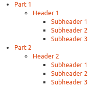]


---
# Text styling

Use `*` or `_` to emphasize things:

```{r, eval =F}
**this is in italic*  and _so is this_  

***this is in bold**  and __so is this__ 

****this is bold and italic***  and ___so is this___ 

```


&nbsp;

*this is in italic*  and _so is this_

**this is in bold**  and __so is this__

***this is bold and italic***  and ___so is this___


---

Lists 

```{r, eval =F}
- The - character start an unsorted list.
+ or you can also use the + character or the - character


To start an ordered list, write this:
1. this starts a list *with* numbers
2. this will show as number '2.'
53. a wrong number here still shows as number '3.'

```
- The - character start an unsorted list.
+ or you can also use the + character or the - character


To start an ordered list, write this:
1. this starts a list *with* numbers
2. this will show as number '2.'
33. a wrong number here still shows as number '3.'

---

# Tables

You can align text in the columns to the left, right, or center by adding a colon (:) to the left, right, or on both side of the hyphens within the header row.

```{r, eval =F}
| Syntax      | Description | Test Text     |
| :---        |    :----:   |          ---: |
| Header      | Title       | Here's this   |
| Paragraph   | Text        | And more      |

```

| Syntax      | Description | Test Text     |
| :---        |    :----:   |          ---: |
| Header      | Title       | Here's this   |
| Paragraph   | Text        | And more      |


---

# Printing an output as a table with `knitr::kable()`

```{r}
data("iris")
knitr::kable(iris[1:5,])
```

There are many more options that can be set to have particularly good looking table with the `knitr` and `kableExtra` packages ([see here for a detailled documentation](https://bookdown.org/yihui/rmarkdown-cookbook/kable.html)).

---
# Extended table options with `knitr::kable()` and `kableExtra`
```{r}
library(kableExtra)
mtcars[1:4, 1:8] %>%
  kbl() %>%
  kable_paper(full_width = F) %>%
  column_spec(2, color = spec_color(mtcars$mpg[1:4]),
              link = "https://haozhu233.github.io/kableExtra/") %>%
  column_spec(6, color = "white",
              background = spec_color(mtcars$drat[1:4], end = 0.7),
              popover = paste("am:", mtcars$am[1:4]))
```

&nbsp; 


---
# $\LaTeX$ support

### Centered Equation

```{r, eval =F}

$$
f(x)=\frac{1}{\sigma \sqrt{2 \pi}} \mathrm{e}^{-\frac{1}{2}\left(\frac{x-\mu}{\sigma}\right)^{2}}
$$
```


$$
f(x)=\frac{1}{\sigma \sqrt{2 \pi}} \mathrm{e}^{-\frac{1}{2}\left(\frac{x-\mu}{\sigma}\right)^{2}}
$$
    
    
### Inline equation

```{r, eval =F}
Hence, we consider the vector $\boldsymbol{\theta} \in \boldsymbol{\Theta}$
```

Hence, we consider the vector $\boldsymbol{\theta} \in \boldsymbol{\Theta}$


---
# Inline `R` code and `R` code chunks 

```{r, echo =F}
res_1 = 12.68
res_2 = 14.56
```


```{r, eval =F, echo = T}
The upper and lower confidence intervals are `r res_1` and `r res 2`.  #<<
```

The upper and lower confidence intervals are `r res_1` and `r res_2`.

```{r, fig.align="center", fig.height=4}
set.seed(123)
data = rnorm(500)
mean_x = mean(data)
hist(data)
```


---

# `knitr` options

In a `.Rmd` document, you can specify multiple chunk option in the ````{r}` header of a `R` chunk of code.

Chunk options are written in the form `tag=value` like `echo=T`

Here are the ones I use the most frequently (Find an exhaustive list of `knitr` options [here](https://yihui.org/knitr/options/#chunk-options).):

| `knitr` chunk option      | Description | 
| :---                   |                :--- |  
| `echo`              |                 Whether to echo the source code in the output document (someone may not prefer reading your smart source code but only results).       | 
| `eval`               |                 Whether to evaluate a code chunk.        | 
| `results`               |                 When set to 'hide', text output will be hidden; when set to 'asis', text output is written “as-is,”        | 
| `cache`               |                 Whether to enable caching. If caching is enabled, the same code chunk will not be evaluated the next time the document is compiled (if the code chunk was not modified), which can save you time.        | 
| `fig.align`, `fig.width`  & `fig.height`             |                 The (graphical device) size of R plots in inches. R plots in code chunks are first recorded via a graphical device in knitr, and then written out to files.        | 


---
# Bibliography

- Save a file in the same directory of your `.Rmd` file with extension `.bib`.
- Reference this file in the `YAML`.
For example considering the file `biblio.bib` 

```{r, eval =F}
---
title: Scientific Reporting
author: Lionel Voirol
date: "`r format(Sys.time(), '%d %B, %Y')`"
output:
  html_document:
    css: "my_style.css"
    toc: true
    theme: united 
bibliography: biblio.bib #<<
---
```

You can then insert citation as such:
```{r, eval = F}
"L'absurdité est surtout le divorce de l'homme et du monde." @camus1972etranger
```


---
# Bibliography

### Copying `.bib` references from Google Scholar

.center[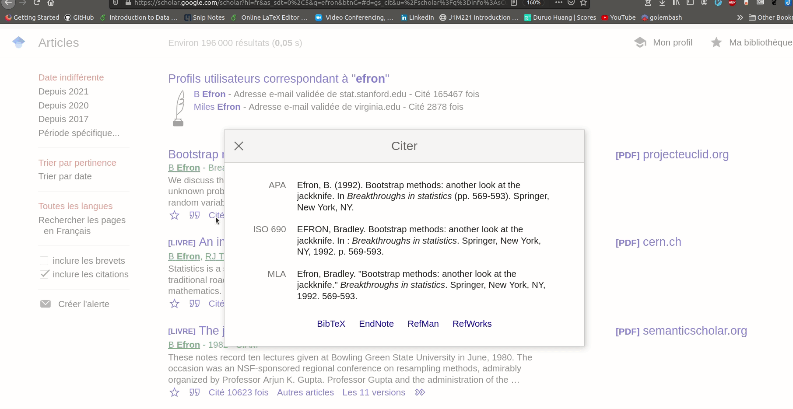]


---
# Images

```{r, eval =F}
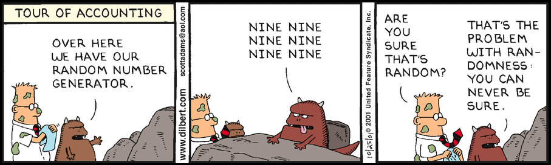
```

.center[]

---

# Emojis and icons
```{r,eval =F}
`r emo::ji('alien')` `r emo::ji('sunglasses')` `r emo::ji('fire')`
```

&nbsp; 
<center>
`r emo::ji('alien')` `r emo::ji('sunglasses')` `r emo::ji('fire')`
</center>

```{r, eval =F}
icon::fontawesome("rocket") 
icon::fontawesome("github")
```


<center>
`r icon::fontawesome("rocket") `
`r icon::fontawesome("github") `
</center>


&nbsp; 


For more info see [the icon `r icon::fontawesome("github")` repo](https://github.com/ropenscilabs/icon) and [the emo `r icon::fontawesome("github")` repo](https://github.com/hadley/emo).


---

class: inverse, center, middle

# Interactive elements


---
# GIF with `iframe` tag

.scroll-box-80[
```{r, eval =F}
<iframe src="https://giphy.com/embed/l46CsCs3cOTdErUuk" width="480" height="363" frameBorder="0" class="giphy-embed" allowFullScreen></iframe><p><a href="https://giphy.com/gifs/election2016-hillary-clinton-i-believe-in-science-l46CsCs3cOTdErUuk">via GIPHY</a></p>
```
]

&nbsp; 

<center>


<iframe src="https://giphy.com/embed/l46CsCs3cOTdErUuk" width="480" height="263" frameBorder="0" class="giphy-embed" allowFullScreen></iframe><p><a href="https://giphy.com/gifs/election2016-hillary-clinton-i-believe-in-science-l46CsCs3cOTdErUuk">via GIPHY</a></p>
</center>


---
# HTML widgets

### `plotly` example


.scroll-box-20[
```{r, eval=T, echo=T, message=F, warning=F}
rm(list=ls())
library(plotly)
library(reshape2)
# example from https://stackoverflow.com/questions/38331198/add-regression-plane-to-3d-scatter-plot-in-plotly
#load data
my_df <- iris
petal_lm <- lm(Petal.Length ~ 0 + Sepal.Length + Sepal.Width,data = my_df)
# Graph Resolution (more important for more complex shapes)
graph_reso <- 0.05
#Setup Axis
axis_x <- seq(min(my_df$Sepal.Length), max(my_df$Sepal.Length), by = graph_reso)
axis_y <- seq(min(my_df$Sepal.Width), max(my_df$Sepal.Width), by = graph_reso)
#Sample points
petal_lm_surface <- expand.grid(Sepal.Length = axis_x,Sepal.Width = axis_y,KEEP.OUT.ATTRS = F)
petal_lm_surface$Petal.Length <- predict.lm(petal_lm, newdata = petal_lm_surface)
petal_lm_surface <- acast(petal_lm_surface, Sepal.Width ~ Sepal.Length, value.var = "Petal.Length") #y ~ x
#define color
mycol = RColorBrewer::brewer.pal(n = 3, name = "Dark2")
hcolors=c(mycol)[my_df$Species]
iris_plot <- plot_ly(my_df, 
                     x = ~Sepal.Length, 
                     y = ~Sepal.Width, 
                     z = ~Petal.Length,
                     text = ~Species, # EDIT: ~ added
                     type = "scatter3d", 
                     mode = "markers",
                     marker = list(color = hcolors))
iris_plot <- add_trace(p = iris_plot,
                       z = petal_lm_surface,
                       x = axis_x,
                       y = axis_y,
                       type = "surface")
iris_plot
```
]


---
# HTML widgets


<div align="center">

```{r, eval=F, echo=F, message=F, warning=F, fig.align="center"}
rm(list=ls())
library(plotly)
library(reshape2)
# example from https://stackoverflow.com/questions/38331198/add-regression-plane-to-3d-scatter-plot-in-plotly
#load data
my_df <- iris
petal_lm <- lm(Petal.Length ~ 0 + Sepal.Length + Sepal.Width,data = my_df)
# Graph Resolution (more important for more complex shapes)
graph_reso <- 0.05
#Setup Axis
axis_x <- seq(min(my_df$Sepal.Length), max(my_df$Sepal.Length), by = graph_reso)
axis_y <- seq(min(my_df$Sepal.Width), max(my_df$Sepal.Width), by = graph_reso)
#Sample points
petal_lm_surface <- expand.grid(Sepal.Length = axis_x,Sepal.Width = axis_y,KEEP.OUT.ATTRS = F)
petal_lm_surface$Petal.Length <- predict.lm(petal_lm, newdata = petal_lm_surface)
petal_lm_surface <- acast(petal_lm_surface, Sepal.Width ~ Sepal.Length, value.var = "Petal.Length") #y ~ x
#define color
mycol = RColorBrewer::brewer.pal(n = 3, name = "Dark2")
hcolors=c(mycol)[my_df$Species]
iris_plot <- plot_ly(my_df, 
                     x = ~Sepal.Length, 
                     y = ~Sepal.Width, 
                     z = ~Petal.Length,
                     text = ~Species, # EDIT: ~ added
                     type = "scatter3d", 
                     mode = "markers",
                     marker = list(color = hcolors))
iris_plot <- add_trace(p = iris_plot,
                       z = petal_lm_surface,
                       x = axis_x,
                       y = axis_y,
                       type = "surface")
iris_plot
```

</div>

You can find a gallery of `html widgets` for `R` [here](https://www.htmlwidgets.org/showcase_leaflet.html).


---
# Youtube with `iframe` tag
### Musical break with Koffi Olomidé interpreted by Youssoupha

```{r, eval =F}
<iframe width="560" height="315" src="https://www.youtube.com/embed/RALtocwIcWI?start=391" title="YouTube video player" frameborder="0" allow="accelerometer; autoplay; clipboard-write; encrypted-media; gyroscope; picture-in-picture" allowfullscreen></iframe>
```


<center>
<iframe width="760" height="415" src="https://www.youtube.com/embed/RALtocwIcWI?start=391" title="YouTube video player" frameborder="0" allow="accelerometer; autoplay; clipboard-write; encrypted-media; gyroscope; picture-in-picture" allowfullscreen></iframe>
</center>

---

# `RMarkdown playground` web app

Find the app [here](https://dal-unige.shinyapps.io/rmd_app/).

```{r, echo = F}
knitr::include_url("https://dal-unige.shinyapps.io/rmd_app/", height = "450px")
```


---
class: inverse, center, middle

# Your turn! (Group exercise)

&nbsp; 

.center[In group and working in breakout rooms, try to compile a `.Rmd` document with a title, author, date, compiled `R` code, and a statistical graph (e.g. boxplot, histogram, barplots, etc) of your choice. You can also try to add other elements discussed (tables, gif, youtube video, etc). Show it to the audience if interested!]

.center[Also, try to reproduce this equation in your document: 

$$s^{2}=\frac{\sum_{i=1}^{n}\left(x_{i}-\bar{x}\right)^{2}}{n-1}$$]

Hint: use $\LaTeX$ commands `^`,`_`, `\sum{}`,  `\frac{}{}` and `\bar{}`


---

class: inverse, center, middle

# Tools for Scientific reporting


---
# `r icon::fontawesome("github") ` GitHub for collaborative writing/programming


[GitHub](https://github.com/) is a platform which enables sharing and collaboration for software development. It provides a version control system using `Git`.


<div align="center">

</div>


.content-box-blue[
Create an account on [GitHub](https://github.com/) and install [GitHub desktop](https://desktop.github.com/). You can then follow this [serie](https://www.youtube.com/watch?v=XBzUqQbHHhw) of three videos that presents a detailled step-by-step introduction to using GitHub with Github Desktop. You can also read  [this introduction to GitHub](https://docs.github.com/en/desktop/installing-and-configuring-github-desktop/creating-your-first-repository-using-github-desktop).
]


---
# Mathpix to easily insert math equation in $\LaTeX$

<blockquote>

Mathpix Snip digitizes handwritten or printed text, and copies outputs to the clipboard that can be pasted into LaTeX editors like Overleaf, Markdown editors like Typora, Microsoft Word, and more. 
.right[-- <cite>Mathpix Snip</cite>]
</blockquote>


&nbsp; 

<div align="center">
<iframe width="560" height="315" src="https://www.youtube.com/embed/Pc_6aKPYBwQ" title="YouTube video player" frameborder="0" allow="accelerometer; autoplay; clipboard-write; encrypted-media; gyroscope; picture-in-picture" allowfullscreen></iframe>
</div>

Find more informations [here](https://mathpix.com/).


---
# `xaringan::infinite_moon_reader()` for live preview of your document

Instant preview without fully rebuilding HTML, and the linked navigation

<div align="center">

</div>

---
class: inverse, center, middle

# Advanced customization options

---

# Customization and template for `.pdf` compilation

When compiling a `.Rmd` document to a `.pdf` format, you specify customization by specifying $\LaTeX$  and `pandoc` options. If you compile a `.Rmd` document to a `.pdf`, you specify `CSS` and `HTML` options. You can find further details about customization of `.pdf` compiled-report [here](https://bookdown.org/yihui/rmarkdown/pdf-document.html).

If you want to use `RMarkdown` for your semester project and want to consider customizing the default `.pdf` compilation options, we suggest that you consider using the package `stevetemplates` that provides some template for `Rmarkdown` academic report compiled in `.pdf`.

To do so, install the package from `CRAN`:

```{r, eval = F}
install.packages("stevetemplates")
```

In `RStudio` you can then go to `File` > `New File` > `R Markdown` and select any template you’d like to use. 

---
# Customization and template for `.pdf` compilation

.center[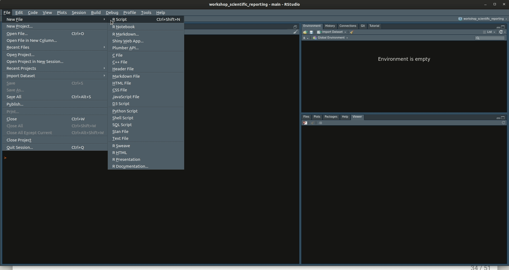]


---

# Themes

You can specify themes with the `YAML` option `theme`. `Rmarkdown` provide built-in themes but many themes are accessible by using external packages available on `CRAN` or on  GitHub. Two packages offer several templates:

- `prettydoc` by Yixuan Qiu
- `rmdformats` by Julien Barnier


```{r, eval =F}
---
title: Scientific Reporting
author: Lionel Voirol
date: "`r format(Sys.time(), '%d %B, %Y')`"
output:
  html_document:
    css: "my_style.css"
    toc: true
    theme: united #<<
bibliography: biblio.bib

---
```

---
# Themes

Find a non exhaustive gallery of available themes [here](https://www.datadreaming.org/post/r-markdown-theme-gallery/).


.pull-left[
.center[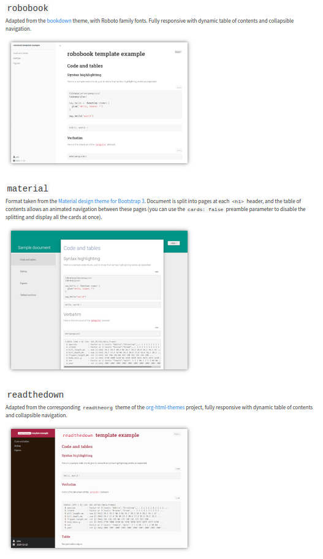]
]


.pull-right[
.center[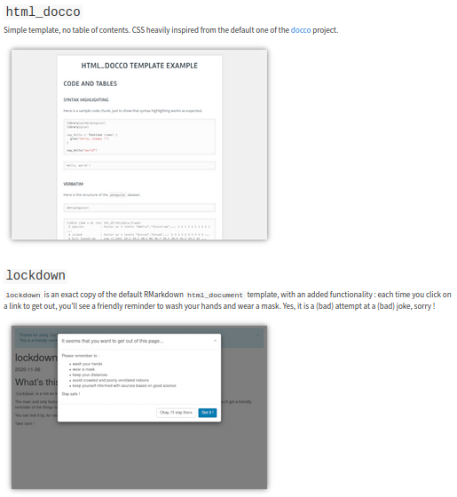]
]


---
# Custom `CSS`

```{r,eval = F}
output:
  html_document:
    css: "style.css" #<<
```

### Centered header
```{css, eval =F}
h1, h2, h3 {
  text-align: center;
}
```

### Change color of hyperlinks
```{css, eval =F}
a {
  color: dodgerblue;
}
```

etc...


---


# `HTML` and `CSS` inline elements
### Pop-up menu and color box

```{r, eval =F}
<button data-toggle="collapse" data-target="#demo">
More info
</button>
<div id="demo" class="collapse">
<p>Some additional info… :)</p>
</div>
```


.center[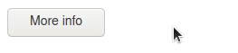]


```{r, eval =F}
<div class="alert alert-success">
<p><strong>Some important Info:</strong> something</p>
```

.center[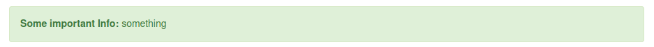]


---
# References 

- [R Markdown (RStudio)](https://rmarkdown.rstudio.com/)

- [Rstudio cheatsheet](https://www.rstudio.com/wp-content/uploads/2015/02/rmarkdown-cheatsheet.pdf)

- [RMarkdown: The Definitive Guide](https://bookdown.org/yihui/rmarkdown/)

- [RMarkdown Cookbook](https://bookdown.org/yihui/rmarkdown-cookbook/)

- [R for Data Science, chapter on RMarkdown](https://r4ds.had.co.nz/r-markdown.html)

- [An Introduction to Statistical Programming Methods with R, chapter on RMarkdown](https://smac-group.github.io/ds/section-rmarkdown.html)

- [Pimp my RMD: a few tips for R Markdown](https://holtzy.github.io/Pimp-my-rmd/)

- [Rmarkdown templates for PDF compilation](https://github.com/svmiller/stevetemplates)


---
class: sydney-blue, center, middle
background-size: 260px
background-position: 5% 95%

# Thank you

### Any questions?

.pull-down[

<a href="mailto:garth.tarr@sydney.edu.au">
.white[`r icon::fontawesome("paper-plane")` Lionel.Voirol@unige.ch]
</a>

<a href="http://github.com/garthtarr">
.white[`r icon::fontawesome("github")` @lionelvoirol]
</a>

<br><br><br>

]

